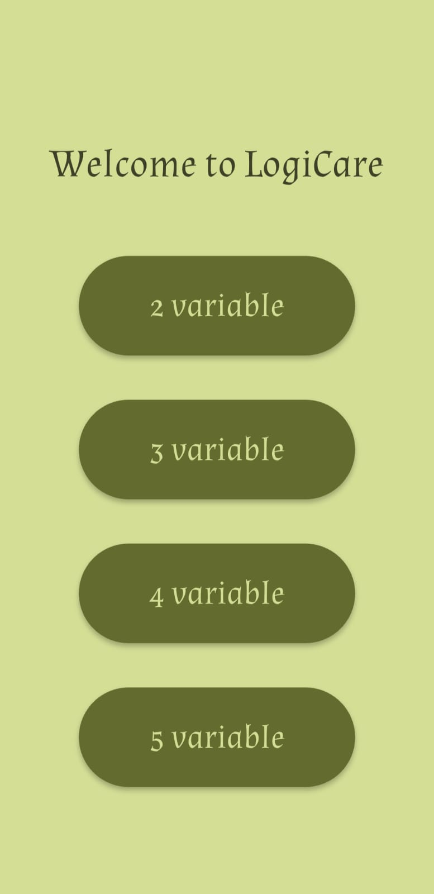
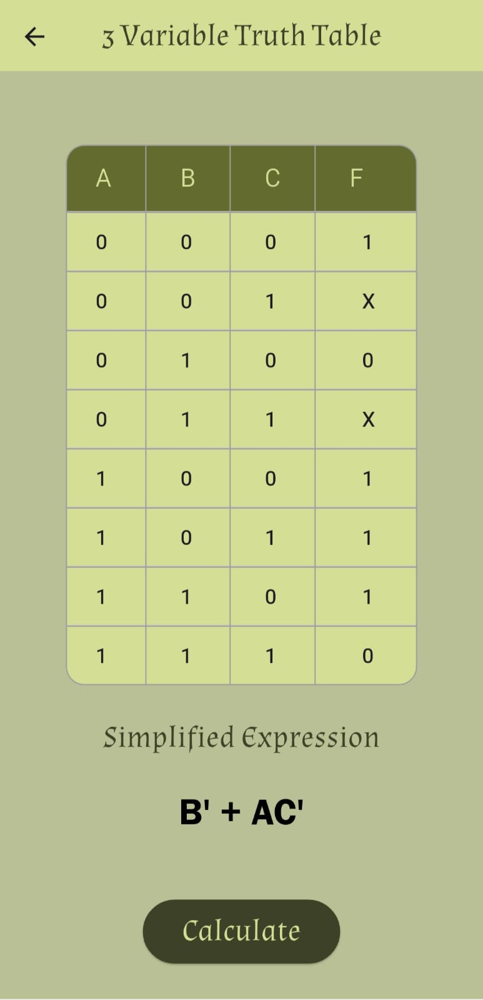

# LogiCare 🧠🔢

**LogiCare** is a logic simplification app built with Flutter. It allows users to input truth tables for 2 to 5 variables and simplifies the boolean expression using the **Quine-McCluskey algorithm**. Ideal for students, educators, and digital logic enthusiasts.

---

## 🔧 Features

- 📌 Supports **2 to 5 input variables**
- 📋 Interactive **truth table editor** (output values can be set as `0`, `1`, or `X` for don't care)
- ⚙️ Uses **Quine-McCluskey Algorithm** to generate minimal boolean expressions
- 🖼 Clean UI and responsive layout
- 📤 Real-time calculation on button click

---

## 📸 Screenshots

  
  

---

## 🚀 How to Use

1. **Select number of variables** (2, 3, 4, or 5) using buttons on the main screen.
2. **Fill the truth table** with desired outputs:
   - `1` for **true**
   - `0` for **false**
   - `X` for **don't care**
3. Press the **Calculate** button.
4. Get the **simplified boolean expression** instantly.

---

## 🧠 Logic Used

The core of the app uses the **Quine-McCluskey Algorithm**, a tabular method for minimizing boolean functions. It handles don’t care conditions and ensures the output expression is in its most optimized form.

---

## 📱 Download APK

👉 [Download the latest APK](https://github.com/Zuhayer-Tajbid/LogiCare/releases/tag/v1.0.0)

--- 
## 📱 Built With

- **Flutter**
- **Dart**

